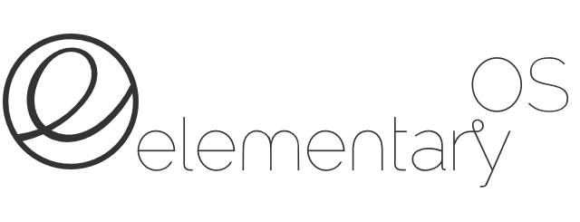
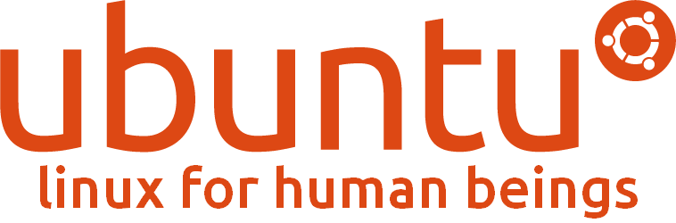

# An Overview of Linux Distributions
Like I said in the [overview](README.md#overview), it really isn't of much consequence what distro you choose.  But it's fun to choose and good to educate yourselves so without further ado, here are some of the most popular distros available today.

## Contents
* [Arch](#arch-linux)
* [CentOS](#centos)
* [Debian](#debian)
* [ElementaryOS](d#elementaryos)
* [Fedora](#fedora)
* [Linux Mint](#linux-mint)
* [Ubuntu](#ubuntu)

### Arch Linux

**Overview** Arch Linux is typically considered to be the most customizable version of Linux. It's designed to be flexible, lightweight, and above all, "Keep it Simple".  That doesn't mean it's simple for the user though.  That means Arch is stripped down.  Right off the bat you're thrown into a terminal where you'll have to partition the hard drive and configure the installation yourself.  When you first install Arch, you'll have nothing but a terminal to work with.  You're in charge of setting up network connections, desktop environment, window manager, and any applications you like on your own.  It does come with a very thorough package manager called AUR though.

**Ease of installation/Use** Hard

**My Thoughts** Arch is the kind of distro you shouldn't install unless you know what you're doing or are willing to fail over and over again trying to learn.  This is without a doubt the hardest Linux distro on this list to learn and I can't say I recommend it for new users.  Some people suggest starting off with Arch and "throwing yourself into the deep end" as a way of learning, but I've found this scares away more people than it inspires.  If you're new to Linux, I'd say check out something else on this list first and maybe come back to this once you're comfortable with the terminal. This is one distro you should shy away from if you're not looking for a challenge.  For those who do manage to get everything working though, the power and flexibility Arch provides are very rewarding.

### CentOS

**Overview** CentOS, which is short for Community Enterprise Operating System, is the community version of Red Hat Enterprise Linux.  Red Hat releases the source code for each version of RHEL, and the CentOS community makes some modifications, recompiles the code, and releases it as CentOS. It's designed for people who want the stability and quality of an enterprise Linux distribution without paying for service.

**Ease of installation/Use** Medium

**My Thoughts** CentOS is a very solid distro.  If you're looking to install something that you don't want to update very often, this is a great choice.  With that being said, CentOS is by no means bleeding edge so don't expect to find the most up-to-date packages and tools to be available.

### Debian

**Overview**

**Ease of installation/Use** Medium

**My Thoughts**

### ElementaryOS

**Overview** Widely considered to be the best looking distro, ElementaryOS is based on [Ubuntu](#ubuntu), but features its own custom desktop environment. Beyond that, ElementaryOS is similar to Ubuntu in almost every way.

**Ease of installation/Use** Easy

**My Thoughts** The first distro on this list that I can comfortably say is simple enough for my grandmother to use, the desktop environment here looks uncannily similar to the OS X desktop environment.  I'm personally not a huge fan the OS X interface but I know its something many designers, developers, and end users love.  If you want a distro with the function of Linux but the UI/UX of a Mac, this is the one for you.

### Fedora

**Overview** If you were to survey a group of Linux users to find out which Linux distro is best for developers, probably 90% of them would (wisely) say that it doesn't really matter.  Most of the rest would point you toward Fedora, an operating system that has gained a reputation as being developer-centric in part due to its connection with Red Hat.  Fedora is the upstream repository for Red Hat Enterprise Linux and [Centos](#centos) (that means RHEL and CentOS are based off the code for Fedora), Because of this, it has an enormous support base not just from individual community members, but from Red Hat itself as well as some of their customers.  Fedora has one of the strongest focuses on free and open source software (FOSS) of any distro.  Everything in Fedora's software repository is FOSS.  Non-FOSS applications (e.g. Spotify) can be installed on Fedora by way of third-party repositories.

**Ease of installation/Use** Medium

**My Thoughts** Fedora was my first Linux Distro and it's still the one I use today so perhaps I'm a bit biased here when I say that Fedora is a really nice operating system and a great first Linux distro.  It's not quite as simplified as some other distros are, but believe me when I say that its plenty easy to learn.  Fedora's come a long way in the past few years and features like an updated installer and a GUI-based software center have really helped its accessibility to new users.  In my opinion, Fedora finds a nice balance between accessibility and power use. It doesn't hold your hand quite as much as some other istros, nor does it throw you in the deep end.

### Linux Mint

**Overview** Linux Mint is currently the most popular Linux distro available.  Mint was originally built as a distro on top of [Ubuntu](#ubuntu).  It became popular because it came packaged With proprietary media codecs and other things that Ubuntu did not.  The default desktop environment for Mint is Cinnamon, which is based off of GNOME 2.  In the past, Mint had a reputation as being unstable because the developers were always trying to keep up with the newest version of Ubuntu. However, since basing Mint off of Ubuntu's LTS (long term support) versions, Linux Mint has become widely regarded as one of the best distros around.

**Ease of installation/Use** Easy

**My Thoughts** Linux Mint is a fantastic distro, especially for beginners. It's poplarity (and use of Ubuntu as a basis) creates a huge community of users to learn from, and it's default Cinnamon interface will be much more familiar to users than Unity and GNOME 3.  Also, the Cinnamon terminal is beautiful.  If I wasn't able to use Fedora, my first choice of Linux distro would have to be Mint

### Ubuntu

**Overview** This is probably the most well known Linux distro, although it was recently overtaken by [Linux Mint](#linux-mint) as most popular.  Ubuntu is based on [Debian](#debian) although it. Another great option for beginners, Ubuntu is packed full of features such as a mature software center that make it so the user can function just fine without the terminal.  Ubuntu, whose name comes from an ancient African word meaning "humanity towards others", it has a reputation for being quite polished and up-to-date.  Ubuntu's default interface is the Unity interface.  The Unity interface was developed in-house at Cannonical, the company the supports Ubuntu development.  The switch to Unity from GNOME 2 was quite polarizing, and caused many Ubuntu users to switch distros or install other desktop environments such as MATE or KDE. With that being said, the Unity interface has developed into a very mature desktop environment that functions particularly well on smaller screens and touch screens.

**Ease of installation/Use** Easy

**My Thoughts** Ubuntu is a very polarizing distro in that many Linux users love it, while other users see it as too simplified.  I see Ubuntu as a sort of gateway drug to Linux.  I think its a great first distro but its not one I would stick with forever.  With that being said, its a great distro and certainly one that everybody should try out.  I also have to say I really like the Unity interface, although I do like the GNOME 3 interface as well which was similarly polarizing.
